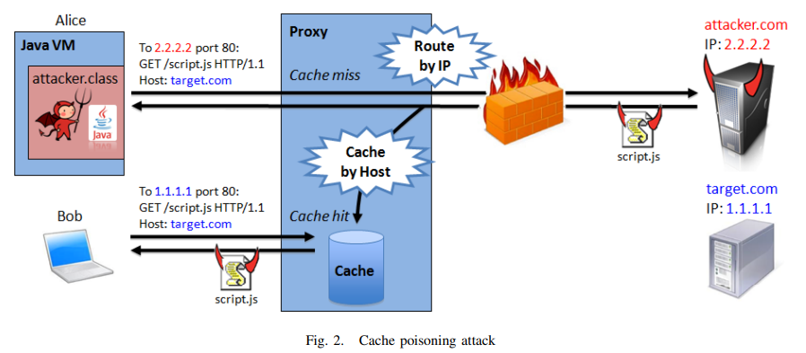

## WebSockets

WebSockets are a level 7 (application layer) protocol running on top of TCP, just like HTTP. It makes it possible to open a two-way interactive communication session between the user's browser and a server - it does not rely on the client-request/server-response cycle. The server can send message to the client without being requested. It is designed to work over HTTP ports 443 and 80, as well as to support HTTP proxies and intermediaries, making it compatible with HTTP. The WebSocket handshake uses the HTTP Upgrade header.

### WebSockets handshake

A client has to start the WebScoket handshake process by contacting the server and requesting a WebSocket connection. This is done using an HTTP request:
```
GET /my_path HTTP/1.1
Host: example.com:8000
Upgrade: websocket
Connection: Upgrade
Sec-WebSocket-Key: dGhlIHNhbXBsZSBub25jZQ==
Sec-WebSocket-Version: 13
```

The server should then send back the following HTTP response:

```
HTTP/1.1 101 Switching Protocols
Upgrade: websocket
Connection: Upgrade
Sec-WebSocket-Accept: s3pPLMBiTxaQ9kYGzzhZRbK+xOo=
```

The value of `Sec-WebSocket-Accept` is obtained by concatenating the `Sec-WebSocket-Key` string the client sent with the string `258EAFA5-E914-47DA-95CA-C5AB0DC85B11`, taking the SHA-1 hash of the result and returning the base64 encoding of that hash. If the server does not respond with the correct SHA-1 hash, the client must close the Websocket connection. The header has two main purposes - 1) it ensures that both the client and the server actually are aware of Websocket protocol and want to use (makes accidental use much less likely) and 2) it prevents a caching proxy from re-sending a previous Websocket conversation.

Once the server sends these headers. the handshake is complete and data can be swapped.

### Keeping track of clients

The server must keep track of clients' sockets, so we don't keep handshaking again with clients who have already completed the handshake. The server should keep a table of usernames/IDs along with the corresponding WebSocket and other data associated with that connecton. 

### Exchanging data frames

As a stream-oriented protocol, TCP has no concept of messages (or framing), it's just a sequence of bytes. Solutions on top of TCP, like WebSockets, have to provide their own framing. This is what a WebSocket dataframe looks like:


```
 0                   1                   2                   3
 0 1 2 3 4 5 6 7 8 9 0 1 2 3 4 5 6 7 8 9 0 1 2 3 4 5 6 7 8 9 0 1
+-+-+-+-+-------+-+-------------+-------------------------------+
|F|R|R|R| opcode|M| Payload len |    Extended payload length    |
|I|S|S|S|  (4)  |A|     (7)     |             (16/64)           |
|N|V|V|V|       |S|             |   (if payload len==126/127)   |
| |1|2|3|       |K|             |                               |
+-+-+-+-+-------+-+-------------+ - - - - - - - - - - - - - - - +
|     Extended payload length continued, if payload len == 127  |
+ - - - - - - - - - - - - - - - +-------------------------------+
|                               |Masking-key, if MASK set to 1  |
+-------------------------------+-------------------------------+
| Masking-key (continued)       |          Payload Data         |
+-------------------------------- - - - - - - - - - - - - - - - +
:                     Payload Data continued ...                :
+ - - - - - - - - - - - - - - - - - - - - - - - - - - - - - - - +
|                     Payload Data continued ...                |
+---------------------------------------------------------------+
```
[source: RFC spec](https://datatracker.ietf.org/doc/html/rfc6455#section-5.2)

The meaning of the various parts of the frame is well explained in the RFC spec linked above. 

Messages from client to server must have masking, messages from server to client must NOT have masking. Messages are masked using a XOR cipher of the message with a masking key. This is done in order to mitigate risks of a cache poisoning attack. Such an attack could theoretically occur, by an attacker sending a sequence of bytes, which looks like an HTTP GET request to a server under his control, which would then respond with anything he wanted. Caching proxies could then store the response, containing malicious code by the attacker. Other users could then get the malicious code from the proxy. See [here](https://www.adambarth.com/papers/2011/huang-chen-barth-rescorla-jackson.pdf) and [here](https://exchangetuts.com/what-is-the-mask-in-a-websocket-frame-1639540747132068) and the image below:



The size of a frame is limited at the protocol level to 2^63 bytes, which is about 9.22 exabytes. This is because the payload length is signified with 64 bits (and the most significant bit must be 0), so it is not possible to indicate that a frame has a payload size exceeding 63 bit. The size of a message is theoretically unlimited, since the message could be split into an infinite number of frames. The size of the message does not have to be specified up front, only the size of a frame. The `opcode` part of the frame specifies the type of data sent, with `%x0` meaning a continuation frame. The `FIN` byt specifies whether the given frame is the last frame in the message.

The primary purpose of fragmentation is to allow sending a message that is of unknown size when the message is started without having to buffer that message.  If messages couldn't be fragmented, then an endpoint would have to buffer the entire message so its length could be counted before the first byte is sent.  With fragmentation, a server or intermediary may choose a reasonable size buffer and, when the buffer is full, write a fragment to the network.

This seems to be a weakness of the WebSockets protocol - unlimited message size does not seem to be reasonable. If you're writing a server, you'll surely want to impose some limits to prevent DDOS style attacks. Interesting discussion [here](http://www.lenholgate.com/blog/2011/07/websockets-is-a-stream-not-a-message-based-protocol.html) (lenholegate seems to not like WebSocket protocol :-)) and [here](https://news.ycombinator.com/item?id=3377406) and [here](https://www.openmymind.net/WebSocket-Framing-Masking-Fragmentation-and-More/).


### Pings and pongs

At any point after the handshake, either the client or the server can choose to send a ping to the other party. When the ping is received, the recipient must send back a pong as soon as possible. This is used to make sure that the client is still connected.

### WebSockets API/simple example code

```
let socket = new WebSocket("wss://example.com");

socket.onopen = () => {
    socket.send("Hello, server");
}

socket.onmessage = (event) => {
    console.log("Data received from server: ", event.data);
}
```

The data sent via the `send` method can either be a string, or binary format, such as `Blob` or `ArrayBuffer`. We can control in which format we receive binary data by seetting the `socket.binaryType` property to "blob" or "arraybuffer".

The WebSocket object has a couple more methods, properties and events that haven't been shown. 

Properties include `bufferedAmount`, which returns the number of bytes of data that have been queued using calls to `send()` but not yet transmitted to the network (as the socket can only send data as fast as the network allows it, whereas we can put an unlimited amount of data in the `send()` method). There is also `readyState` which returns the current state of the WebSocket connection, one of four values: `CONNECTING`, `OPEN`, `CLOSING` and `CLOSED`.

The only other method than `send()` is `close()`, which, unsurprisingly, closes the connection.

There are also two more events, `onclose` and `onerror`.

Complete overview is available, as usual, on [MDN](https://developer.mozilla.org/en-US/docs/Web/API/WebSocket).


## SocketIO

Reaper does not actually use pure WebSocket. It uses [SocketIO](https://socket.io/), which is a library which makes (or can make) use of the WebSocket protocol. Its main feature is that it provides additional guarantees - a fallback to HTTP long polling when WebSockets aren't supported, and automatic reconnection. Its API is also quite different from the regular WebSockets API, it is modelled on Node JS EventEmitter class.

SocketIO codebase is split into two main parts/layers
- Engine.IO, the low-level plumbing , responsible for establishing the low-level connection between the server and the client
- the high level API: SocketIO itself

### Engine.IO

Currently supports two transports: HTTP long polling and WebSocket.

HTTP long polling transport consists of successive HTTP requests:
- long running GET requests, for receiving data from server
- short running POST requests, for sending fata to server

### EngineIO connection establishment

Details can be found [here](https://github.com/socketio/engine.io-protocol).

1. HTTP request is sent to Engine.IO url, which has the form `host/socket.io/[?<query string>]`, the query string is optional and can have the following keys:
    - `transport`: indicates the transport name, either `polling` or `websocket`. If `websocket` is used then the request also includes the necessary Websocket headers, such as `Sec-WebSocket-Key`, `Sec-WebSocket-Version` etc.
    - `j` if the transport is `polling`, but a JSONP response is required, `j` must be set with the JSONP response index
    - `sid` if the client has been given a session id, it must be included in the query string
    - `EIO` with a numeric value, indicating the version of the protocol (so EIO=3 would indicated EIO v3)
    - `t` a hashed timestamp used for cache-busting
2. The server sends an HTTP response. If the request had `transport=websocket`, then it sends the usual response to a Websocket opening request, meaning status code 101 and headers including `Sec-WebSocket-Accept`. If the request had `transport=polling`, then a regular HTTP 200 response is sent. In both cases however, the response must include the following JSON-encoded handshake data:
```
{
    "sid": string session id
    "upgrades": array of strings possible transport upgrades
    "pingTimeout": server configured ping timeout, used for the client to detect that server is unresponsive
    "pingInterval": server configured ping interval, used for the client to detect that server is unresponsive
    "maxPayload": server configured maximum number of bytes per chunk, used by the client to aggregate packets into payloads
}
```
If the transport is websocket, then this response is sent as a message using the websocket. If it's polling, it is done via HTTP. It can be sent either as text, or as base64 encoded string of binary data.

The client and server can then exchange messages and pings/pongs. 

Ping-pongs in SocketIO are analogous to ping-pongs in Websockets, but they use a different mechanism. SocketIO does not use Websocket ping-pong frames, instead it uses the regular text frame, with a message containing `2` representing a ping sent by the server, to which the client is supposed to respond with a message containing `3`, representing a pong. This is all handled by SocketIO for us, the only thing we need to do is set the `pingTimeout` and `pingInterval` values. Also, interestingly, ping ponging is done in one direction only, only server can send pings, this is another difference to Websockets. However, SocketIO server will respond to pings sent by client. We can see this if we open Firefox dev tools, since Firefox sends pings whenever WebSockets are used.


### Initialization (client side)

The client can be initialized using the `io` method. The `io` method will create a new `Manager` object under the hood, and also create a new `Socket` instance. It then returns the `Socket` instance.

So this:

```
import { io } from "socket.io-client";

const socket = io("ws://example.com/my-namespace", {
  reconnectionDelayMax: 10000,
  auth: {
    token: "123"
  },
  query: {
    "my-key": "my-value"
  }
});
```

is just a shortened version of this:
```
import { Manager } from "socket.io-client";

const manager = new Manager("ws://example.com", {
  reconnectionDelayMax: 10000,
  query: {
    "my-key": "my-value"
  }
});

const socket = manager.socket("/my-namespace", {
  auth: {
    token: "123"
  }
});
```

As we can see, during initialization, the first argument is the URL, the second argument is an object containing options. One interesting options is `transports`, an array, which can contain the values "polling" and/or "websocket". We can either provide a single one of the two, or both in a specific order. This deteremines whether the connection will be made using WebSocket or using HTTP long polling. If both are given, the order determines which one is preferred/tried first. 

The `Manager` class manages the Engine.IO (as seen above) client instance. `Manager` handles reconnection logic. A single `Manager` can be used by several `Socket`s. A single Manager can only be connected to a single URL. However, we can create multiple `Socket`s, each corresponding to a [namespace](https://socket.io/docs/v4/namespaces/).

```
import { Manager } from "socket.io-client";

const manager = new Manager("https://example.com");

const socket = manager.socket("/"); // main namespace
const adminSocket = manager.socket("/admin"); // admin namespace
```

Each namespace has its own event handlers, rooms and middlewares.

However, in most cases, we will not use `Manager` explicitly, usually the level of control over the Engine.IO API that `Manager` provides is not needed. Mostly we will be using the `Socket` class.

### The Socket instance and events (client side)


`Socket` is the fundamental class for interacting with the server. It inherits most of the methods from the Node.js `EventEmitter`, like `emit` (emits an event), `on` (registers event listener for specific event), `once` (registers a one time event listener for a specific event) and `off` (turns off an event listener for a specific event).

The `Socket` has an ephemeral ID, which can be accessed via `socket.id`. It also has a boolean `connected` property, which describes whether the socket is currently connected to the server, `socket.connected`. And we can also access the `Socket`'s `Manager` via `socket.io`.

Each side (client and server) can emit events and register event listeners. The `Socket` class has three special events: `connect`, `disconnect` and `connect_error`. Other than those, we can create our own events with any name that we want. For example:

Server
```
io.on("connection", (socket) => {
  socket.emit("hello", "world");
});
```

Client
```
socket.on("hello", (arg) => {
  console.log(arg); // world
});
```

We can send any number of arguments we want, and all serializable data structure are supported:

Server
```
io.on("connection", (socket) => {
  socket.emit("hello", 1, "2", { 3: '4', 5: Buffer.from([6]) });
});
```

Client
```
// client-side
socket.on("hello", (arg1, arg2, arg3) => {
  console.log(arg1); // 1
  console.log(arg2); // "2"
  console.log(arg3); // { 3: '4', 5: ArrayBuffer (1) [ 6 ] }
});
```

Any event emitted while the Socket is not connected will be buffered until reconnection. This could result in a huge spike of events when the connection is restored. A good way to deal with this are volative events.

#### Acknowledgements

We can also implement something more akin to a request-response API in SocketIO, using acknowledgements. We can add a callback to the `emit` method and to the `on` handler:

Client
```
socket.emit("update item", "1", { name: "updated" }, (response) => {
  console.log(response.status); // ok
});
```

Server


```
io.on("connection", (socket) => {
  socket.on("update item", (arg1, arg2, callback) => {
    console.log(arg1); // 1
    console.log(arg2); // { name: "updated" }
    callback({
      status: "ok"
    });
  });
});
```

#### Volatile events

Volatile events get discarded when the client is not connected. We call them via `socket.volatile.emit("my_event_name", "my_message")`

### Initialization (server side)

The server can be initialized either as a standalone, or with Node's `httpServer`, or with `Express`, and other frameworks. 

Standalone 

```
const { Server } = require("socket.io");

const io = new Server({ /* options */ });

io.on("connection", (socket) => {
  // ...
});

io.listen(3000);
```

with express

```
const express = require("express");
const { createServer } = require("http");
const { Server } = require("socket.io");

const app = express();
const httpServer = createServer(app);
const io = new Server(httpServer, { /* options */ });

io.on("connection", (socket) => {
  // ...
});

httpServer.listen(3000);
```

### The server instance (io)

The server instance has one property - `server.engine`, which is a reference to the underlying Engine.IO server. The engine can be used to 
1. Fetch the number of currently connected clients `io.engine.clientsCount`
2. Generate custom session ID (the sid query parameter) 
```
io.engine.generateId = (req) => {
    return uuid.v4();
}
```

The Engine.IO server also emits three special events:

1. `initial_headers` which we can use to set/customize response headers of **first** HTTP request of the session (the handshake)

```
io.engine.on("initial_headers", (headers, req) => {
  headers["test"] = "123";
  headers["set-cookie"] = "mycookie=456";
});
```

2. `headers` which we can use to set/customize response headers of **each** HTTP request of the session
```
io.engine.on("headers", (headers, req) => {
  headers["test"] = "789";
});
```

3. `connection_error` which is emitted when a connection is abnormally closed

```
io.engine.on("connection_error", (err) => {
  console.log(err.req);      // the request object
  console.log(err.code);     // the error code, for example 1
  console.log(err.message);  // the error message, for example "Session ID unknown"
  console.log(err.context);  // some additional error context
});
```

List of possible error codes:

|Code|Message|
|:----:|:----:|
|0|"Transport unknown"|
|1|"Session ID unknown"|
|2|"Bad handshake method"|
|3|"Bad request"|
|4|"Forbidden"|
|5|"Unsupported protocol version"|

Server methods

- socketsJoin: makes the matching socket instances join the specified rooms
- socketsLeave: makes the matching socket instances leave the specified rooms
- disconnectSockets: makes the mathing socket instances disconnet
- fetchSockerts: returns matching socket instances
- serverSideEmit: emit events to other Socket.IO servers of the cluster, in a multi-server setup

Server events:

- connection. The first argument is a Socket instance:

```
io.on("connection", (socket) => {

});
```

## The Socket instance (server-side)

The socket instance has the following attributes:

- `socket.id` ephemeral ID of the socket, synced with the client-side ID
- `socket.handshake`, containing details about the handshake that happens at the beginning of the Socket.IO session
- `socket.rooms`, a Set of rooms in which the Socket currently is in. By default, every Socket is in a room of its id
- `socket.data` arbitrary object where we can put data
- `socket.conn`, a reference to the underlying Engine.IO socket.

And the following events:
- `disconnect` which is fired upon disconnection
- `disconnecting` which is fired a bit before `disconnect`, when `socket.rooms` is not yet an empty set